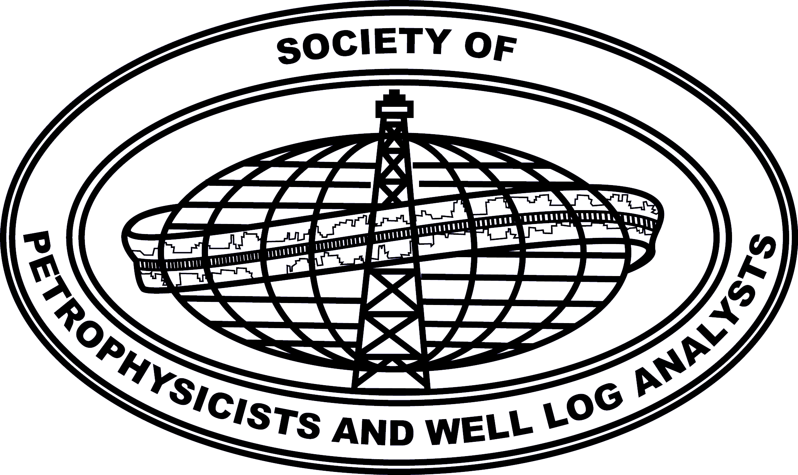

**[[Submit resource](https://github.com/SPWLA-ORG/public-resource/issues/new)]**

# 

## Table of contents

* [Open source](#open-source)
* [Free software](#free-software)
* [Knowledge sharing](#knowledge-sharing)
* [Uncategorized](#uncategorized)

## Resources

#### `Open source`

* [**Python**: _A package to calculate petrophysical properties for formation evaluation_](https://github.com/toddheitmann/petropy)
* [**LaTex**: _A collection of templates relevant for SPWLA community_](https://github.com/SPWLA-ORG/templates)

#### `Free software`

#### `Knowlege sharing`

* [_SPWLA Nuggets of Wisdom_](https://www.youtube.com/channel/UCuY_meTb65lYmGSUNLzj-IA)
* [_Carlos Torres-Verdin_](https://www.youtube.com/channel/UC4nGM9WrCaiZ3jQu9FzU2Sg)

#### `Uncategorized`

## How to contribute

* Contributions are very welcome: [Submit resource](https://github.com/SPWLA-ORG/public-resource/issues/new)
* Help to review [pending submissions](https://github.com/SPWLA-ORG/public-resource/issues) by leaving comments and "reactions"

